# Overview

## Platform Introduction

[ImmunoFusion](https://oncoharmony-network.github.io/ImmunoFusion/) is an interactive web platform for exploring RNA-seq–derived gene fusions in cancer, with a focus on their associations with the tumor microenvironment (TME) and responses to immune checkpoint blockade (ICB). It integrates fusion calls from large treatment-naïve cohorts and multiple ICB cohorts, and links them to rich clinical and TME signatures.

The platform is designed to help you:

- Explore the **pan-cancer landscape** of RNA-derived gene fusions.  
- Examine associations between fusions and **TME, tumor-intrinsic, and metabolic signatures**.  
- Assess **fusion co-occurrence/exclusivity** and compare **fusion-positive vs. fusion-negative** groups.
- Investigate how specific fusions relate to **survival outcomes** in treatment-naïve and ICB-treated cohorts.  

Please cite the ImmunoFusion paper if you use results from this platform in your work.

## Data Overview

ImmunoFusion is the largest cancer fusion gene database, integrating 78 cohorts, 21,000+ samples, and 76,800+ high-confidence fusions, including data from TCGA, TARGET, CPTAC.

**Core Data Metrics:**

- **Cohorts**: 78 (28 IO / 50 non-IO)
- **Samples**: 21,000+ (4,600+ IO / 16,300+ non-IO)
- **Fusions**: 76,800+ (11,100+ IO / 66,000+ non-IO)
- **Genes**: 23,600+ (9,600+ IO / 22,400+ non-IO)
- **Gene Pairs**: 66,900+ (10,200+ IO / 57,800+ non-IO)

The **Data Summary** module provides macro-level statistical views of cohorts and samples, including cohort characteristics (cancer type distribution, IO vs non-IO composition, sex ratio, treatment type and response distribution) and fusion profiles (fusion type and sample type distributions). Users can quickly grasp the overall dataset composition through this module.

## Citation and Disclaimer

This platform is for research purposes only. It does not collect personal information. Clinical use is at your own risk.

---

# Data Modules

## Fusion Module 

The Fusion module is the entry point for inspecting individual fusion events and their basic characteristics.

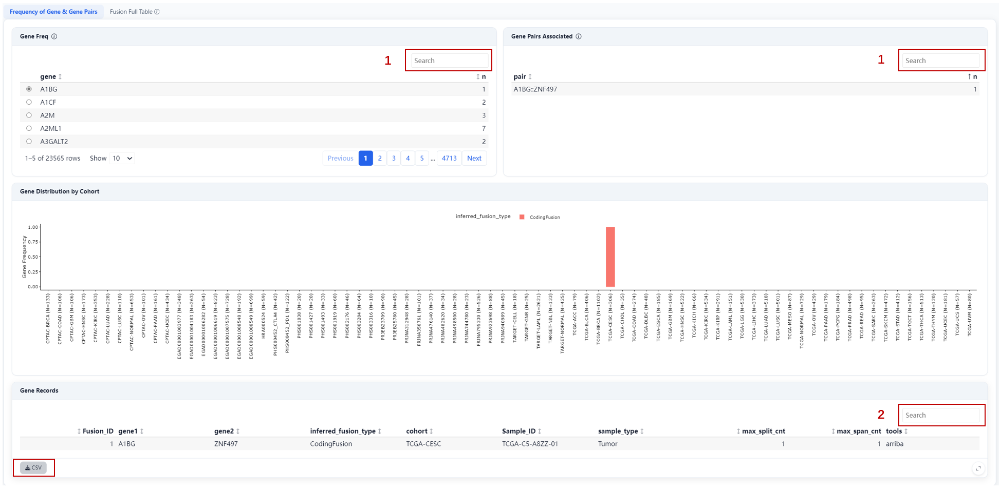{#fig-flow width=100%}

**Steps:**

1. Select gene (optional) or gene pairs (optional);
2. Filter by Gene, Sample_ID, Fusion_ID, etc.

**Outputs:**

- Browse specific fusions and view the distribution of different fusion types across the cohort in the middle panel;
- Download fusion summary tables as CSV files.

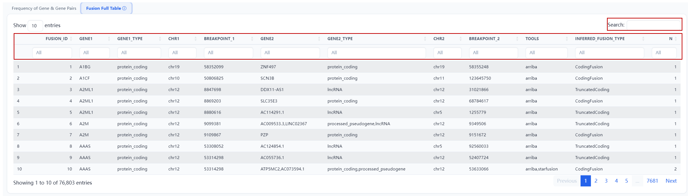{#fig-flow width=100%}

A searchable summary of all fusion events. Supports filtering by gene, fusion type, detection tool, etc. 

## Cohort Module 

The Cohort module provides an overview of all cohorts and datasets in ImmunoFusion.

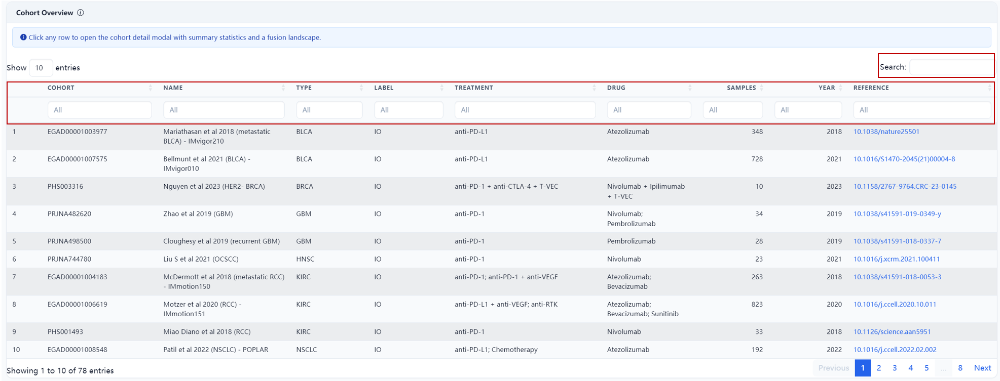{#fig-flow width=100%}

**Displayed Fields:** ID, name, cancer type, treatment/drug details, sample size, publication year/DOI, therapeutic label (e.g., IO), etc.

**Operation:** Search and filter the cohort list using the main search bar or individual column filters.

**Cohort Details**: Click any cohort row to open a detail modal with the following content:

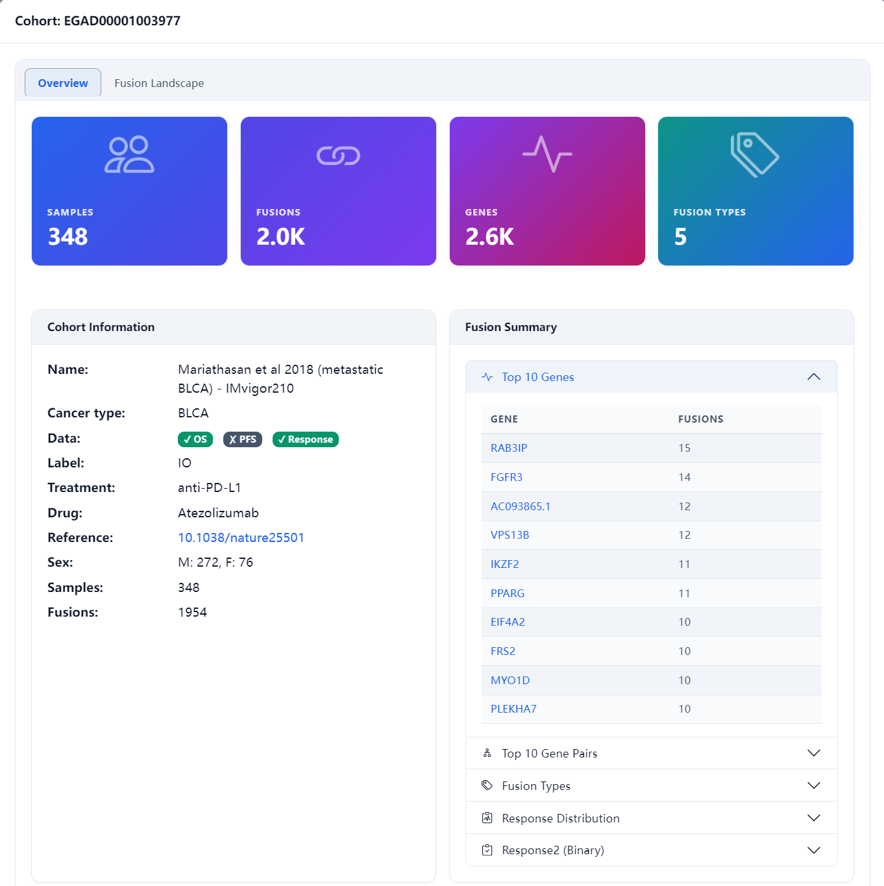{#fig-flow width=70%}

- **Overview**: sample size, total fusions, top fusion genes/gene pairs, fusion type distribution, and response distribution;

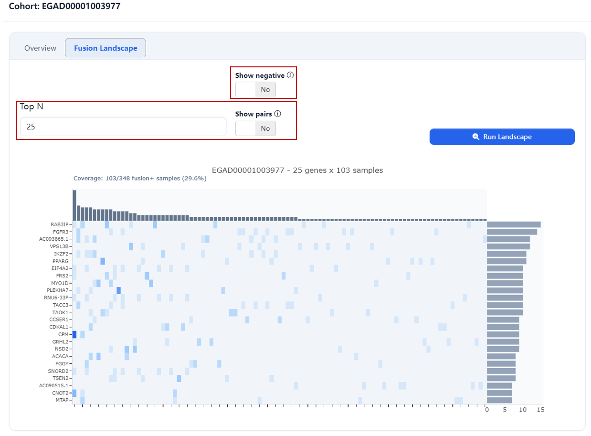{#fig-flow width=80%}

- **Fusion Landscape**: an OncoPrint of the cohort showing fusion event distribution across samples for the Top N genes.

---

# Analysis Modules

The Analysis module consists of several sub-modules, all sharing a unified layout: Analysis controls on the left (cohorts, genes, endpoints, signatures) and Results on the right (interactive plots with export options).

**Export Options**: All analysis modules support chart exports (HTML) and data exports (CSV). Export buttons are located in the results panel of each module.

**Global Filters**: The global filters at the top of the page (fusion type, Score, tools, genes, fusions) apply to all analysis modules — a sample is considered Fusion+ only if it carries at least one fusion passing ALL active filters. Adjust filters to refine the Fusion+ vs. Fusion− grouping across all analyses.

## Distribution 

Evaluate the distribution characteristics of fusion genes across selected cohorts, generating fusion frequency plots, genome-wide breakpoint localization maps (Circos + Lollipop), and multi-dimensional composition charts. This module contains three sub-tabs: Frequency, Localization, and Composition.

### Frequency

Display the frequency distribution of fusion genes/gene pairs across selected cohorts.

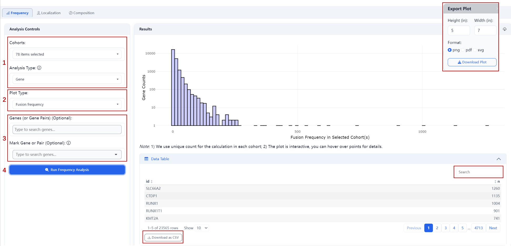{#fig-flow width=100%}
**Steps:**

1. Select one or multiple cohort IDs, analysis type (Gene / Gene Pair);
2. Select plot type: Fusion Frequency or Sample Count;
   - The Fusion Frequency plot displays the total number of fusion events involving each gene across all selected cohorts.
   - The Sample Count plot displays the total number of unique samples carrying each gene fusion across all selected cohorts.
3. Optional: specify target genes or gene pairs for highlighting;
4. Click Run.

**Outputs:**

- Fusion Frequency Mode
Bar plot: X-axis shows the total number of fusion events for each gene (multiple events in the same sample counted separately), Y-axis shows gene counts; data table includes gene names and their fusion counts.
- Sample Count Mode
Bar plot: X-axis shows the number of samples carrying each gene fusion (multiple events in the same sample counted as 1), Y-axis shows gene counts; data table includes gene names and their fusion proportions (prop) across samples.

### Localization

Display genome-wide distribution of fusion breakpoints. Includes two visualization views:

#### Ideogram

Show genome-wide fusion breakpoint density.

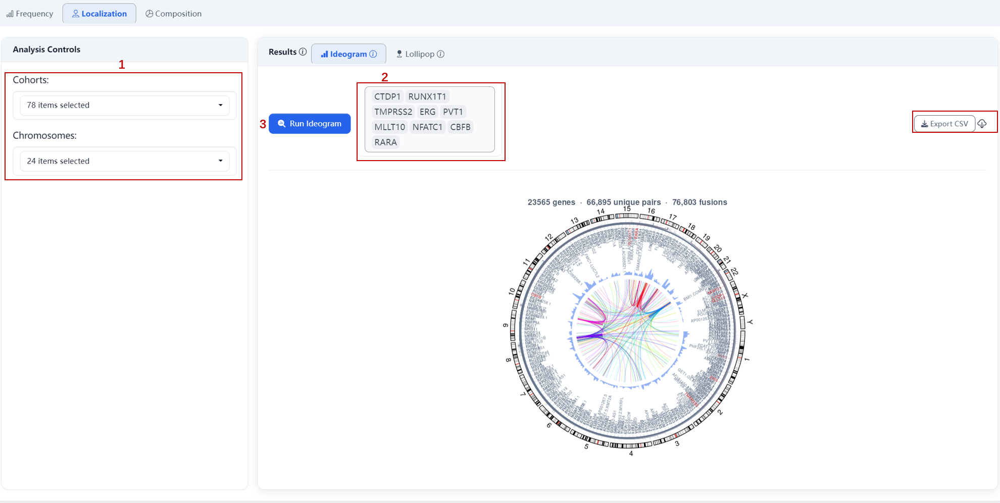{#fig-flow width=100%}
**Steps:**

1. Select cohorts (and optionally filter by chromosomes, all 24 by default);
2. Optional: mark specific genes to overlay fusion partner links;
3. Click Run.

**Outputs:**

- Circos plot: blue heatmap indicates breakpoint density; overlaid links show fusion partners for marked genes;
- Data source: filtered fusion calls aggregated by chromosome position.

#### Lollipop

ProteinPaint-style single-gene view showing fusion breakpoint distribution within a specific gene.

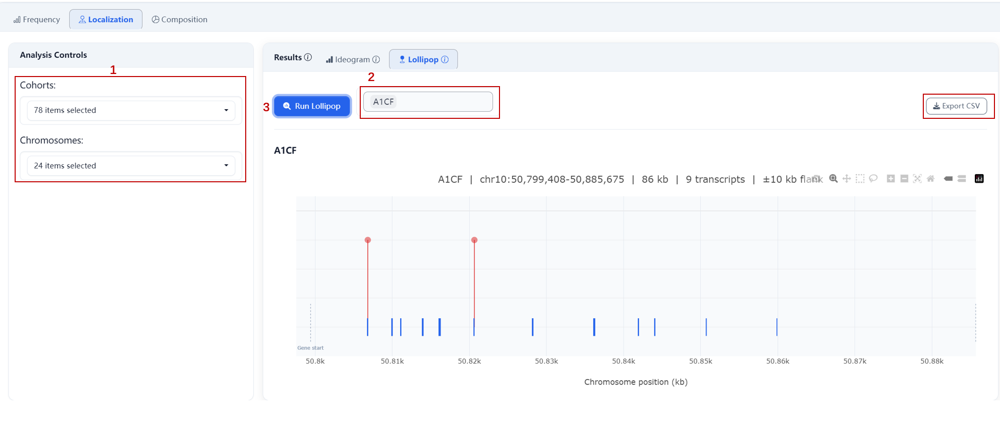{#fig-flow width=100%}

**Steps:**

1. Select cohorts (and optionally filter by chromosomes, all 24 by default);
2. Select target gene name;
3. Click Run.

**Outputs:**

- Gene structure diagram: blue rectangles represent CDS/exons (HG38 BED-based);
- Red circles: intragenic fusion breakpoints; circle size scales with breakpoint count;
- Orange markers: regulatory/distal breakpoints (flanking ±10% gene length);
- Hover for breakpoint details.

### Composition

Display the categorical breakdown of fusion events across multiple dimensions.

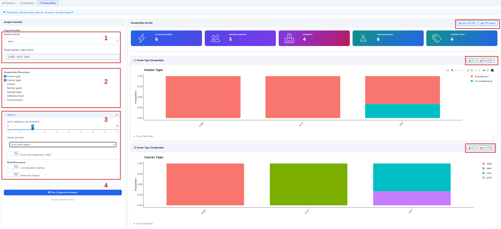{#fig-flow width=100%}

**Steps:**

1. Select analysis level (Gene/ Gene Pair) and target genes/gene pairs (e.g., A1BG, A1CF, A2M);
2. Select composition dimensions: Fusion Type, Cancer Type, Cohort, Partner Gene, Sample Type, Detection Tool, Chromosome (multiple selection allowed);
3. Adjust optional parameters:
   - Top N categories per dimension: number of categories displayed per dimension;
   - Global plot type: Auto (smart detect) or group small categories as "Other";
   - Multi-Dimensional: enable cross-tabulation heatmap or Sankey flow diagram;
4. Click Run Composition Analysis.

**Outputs:**

- Composition bar charts: show fusion event breakdowns across selected dimensions; each bar represents a target gene, with color-coded segments indicating the proportions of different feature categories (e.g., fusion types);
- Optional multi-dimensional views: cross-tabulation heatmap or Sankey flow diagram.

## Comparison

Evaluate associations between fusion events and tumor microenvironment (TME) or IOBR immune signatures, generating box plots comparing feature scores between Fusion+ and Fusion− groups along with statistical test p-values.

This module offers two analysis modes:

- **TME**: compare cell-type abundance by fusion status;
- **IOBR Signature**: compare immune signature scores by fusion status.

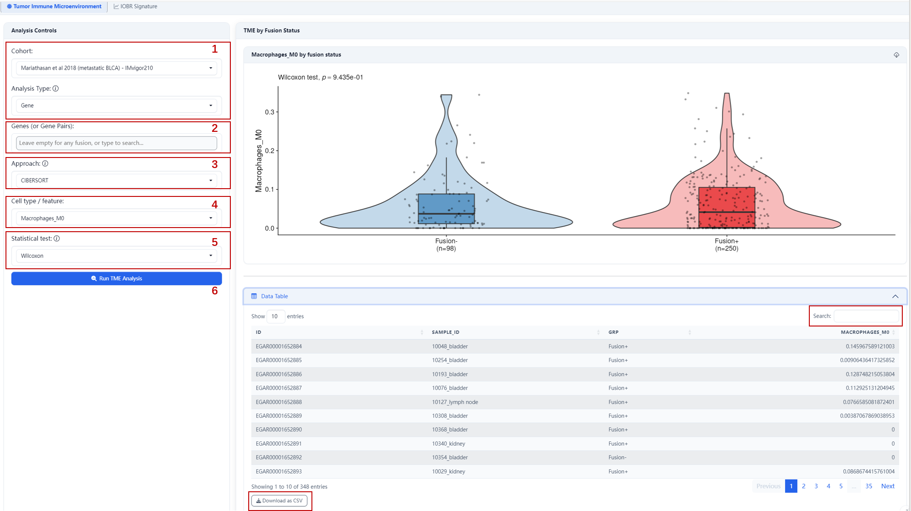{#fig-flow width=100%}

**Steps:**

1. Select target cohort and analysis type (Gene / Gene Pair);
2. Enter target gene/gene pair name(s) (leave empty to use all detected fusions);
3. Select analysis approach
4. Select cell type / feature (e.g., Macrophages_M0, APM);
5. Select statistical test (e.g., Wilcoxon);
6. Click Run.

**Outputs:**

- Box plot: displays feature abundance distribution between Fusion+ and Fusion− groups;
- Statistical results: Wilcoxon test p-value indicating significance between groups;
- Data table: includes sample ID, group label, and feature values; supports search and pagination.

## Association

Explore associations between gene fusions and molecular features, clinical response, and pairwise gene-gene relationships. This module contains three sub-tabs: Correlation, Response, and Gene Interactions.

### Correlation

Evaluate the correlation between fusion count and TME/signature features.

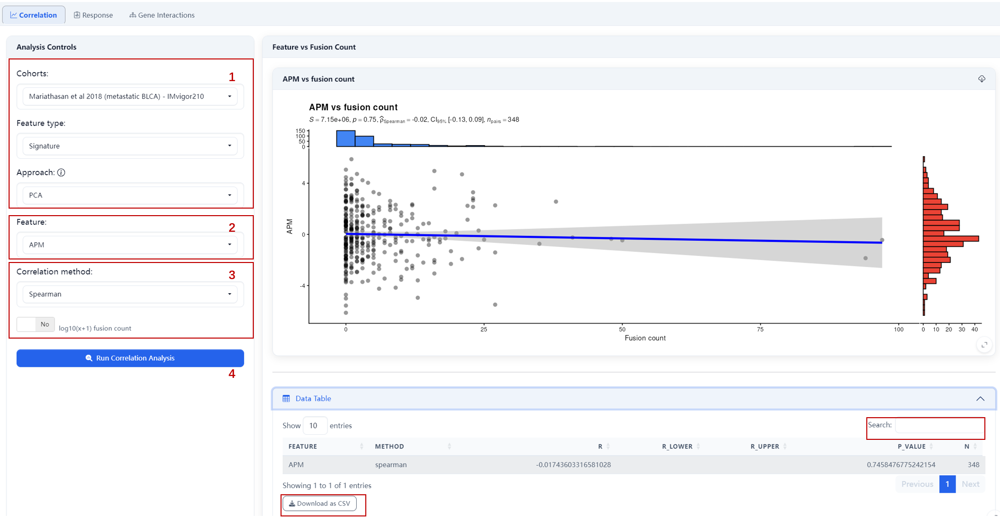{#fig-flow width=100%}
**Steps:**

1. Select target cohort, feature type (Signature/ TME), analysis approach (e.g., PCA);
2. Select specific feature (e.g., APM);
3. Select correlation method (e.g., Spearman) and choose whether to apply log10(x+1) transformation to fusion count;
4. Click Run Correlation Analysis.

**Outputs:**

- Scatter plot: shows relationship between feature scores and fusion count with fitted trend line;
- Statistics: Spearman correlation coefficient (ρ), 95% CI, and p-value.

### Response

Evaluate associations between fusion status and clinical response (binary + RECIST).

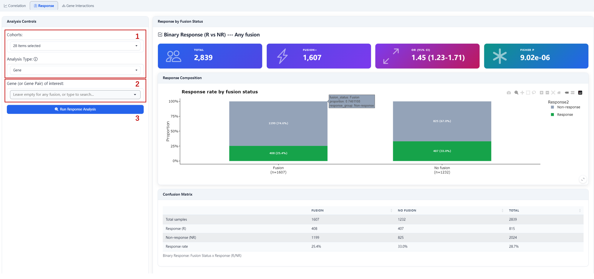{#fig-flow width=100%}

**Steps:**

1. Select one or multiple cohorts and analysis type (Gene/ Gene Pair);
2. Enter target gene/gene pair(s) (leave empty to use any fusion as Fusion+);
3. Click Run Response Analysis.

**Outputs:**

- Response rate bar plot: compares response rates between Fusion+ and Fusion− groups;
- Confusion matrix: shows distribution of response by fusion status;
- Statistics: odds ratio (OR) with 95% CI and Fisher's exact test p-value.

### Gene Interactions

Detect co-occurrence or mutual exclusivity between gene fusion events.

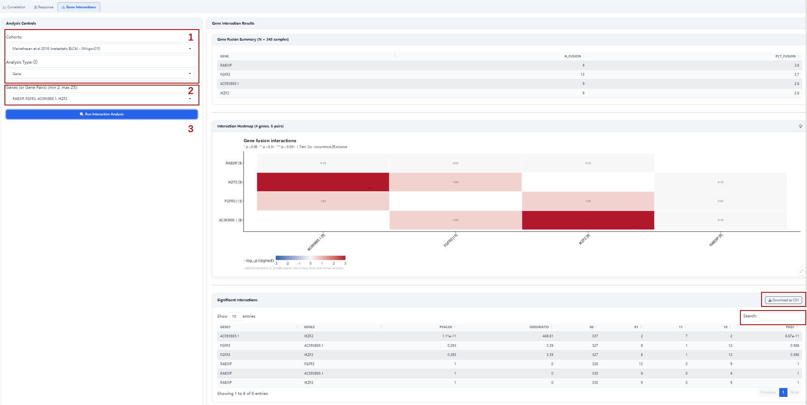{#fig-flow width=100%}
**Steps:**

1. Select target cohort and analysis type (Gene/ Gene Pair);
2. Enter target genes/gene pairs (min 2, max 25);
3. Click Run Interaction Analysis.

**Outputs:**

- Co-occurrence/mutual exclusivity heatmap: shows association patterns between gene pairs;
- Statistics: p-values and odds ratios (OR) for each gene pair.

## Survival (KM)

Evaluate the association between gene fusion status and patient survival by generating and comparing Kaplan-Meier survival curves between Fusion+ and Fusion− groups.

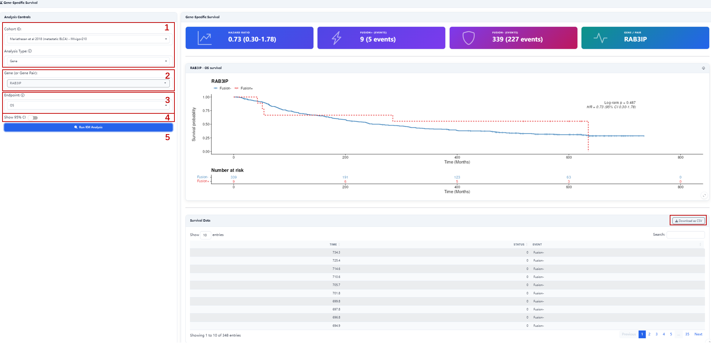{#fig-flow width=100%}
**Steps:**

1. Select target cohort and analysis type (Gene / Gene Pair);
2. Enter target gene/gene pair name (defines Fusion+ vs Fusion− grouping);
3. Select survival endpoint (e.g., OS);
4. Optional: check Show 95% CI to display confidence intervals;
5. Click Run KM Analysis.

**Outputs:**

- KM survival curves: show survival probability over time for both groups;
- Log-rank test p-value: indicates whether survival curves differ significantly;
- Hazard ratio (HR) with 95% confidence interval;
- Survival data table: includes time and event status; supports search and pagination.

## Cox Regression

Evaluate the independent prognostic value of gene fusions using multivariable Cox proportional hazards regression, with optional adjustment for clinical covariates.

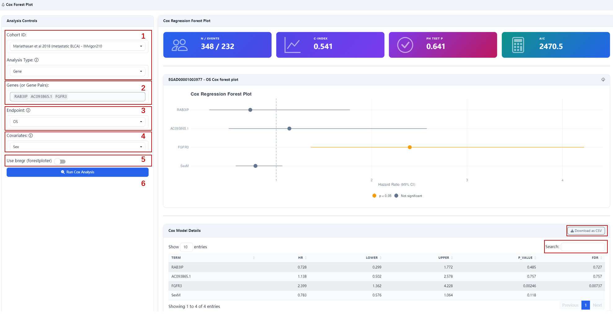{#fig-flow width=100%}
**Steps:**

1. Select target cohort and analysis type (Gene / Gene Pair);
2. Select target gene/gene pair names (multiple allowed);
3. Select survival endpoint (e.g., OS);
4. Select clinical covariates (e.g., Sex);
5. Optional: check Use breg (forestplotter) to enable the dedicated forest plot rendering engine.
6. Click Run Cox Analysis.

**Outputs:**

- Forest plot: displays hazard ratios (HR) and 95% CI for each fusion gene and covariate;
- Model summary statistics:
  - C-index: model discriminative ability (0.5 = random, >0.7 = acceptable);
  - PH test p: proportional hazards assumption test (>0.05 indicates assumption holds);
  - AIC: model fit quality indicator;
- Detailed results table: includes HR, 95% CI, p-values, and FDR-adjusted values for each variable.

## Landscape

Visualize the fusion landscape within a single cohort as an OncoPrint. Each column represents a sample; each row represents a gene or gene pair. Colored rectangles indicate detected fusion types.

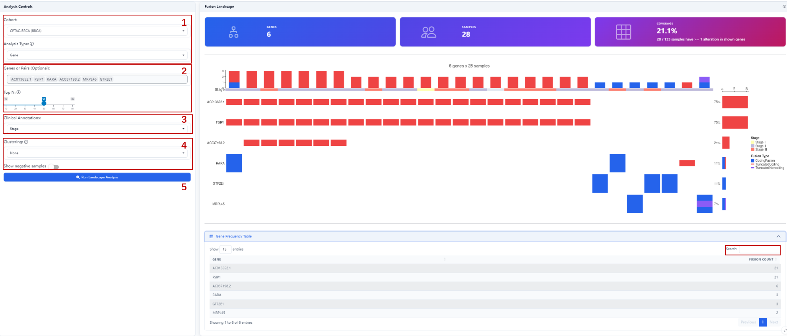{#fig-flow width=100%}

**Steps:**

1. Select target cohort and analysis type (Gene / Gene Pair);
2. Enter target gene/gene pair names (optional), or set Top N to display the top fusion-frequency genes (leave empty for auto-detection).
3. Select clinical annotation covariates (e.g., Stage) for sample-level annotation bars;
4. Optionally select a clustering method (None / Samples only / Genes only / Both axes) and toggle whether to include samples without fusions (Show negative samples).
5. Click Run Landscape Analysis.

**Outputs:**

- OncoPrint main plot: shows fusion event distribution for each gene across samples;
- Top annotation bars: display selected clinical covariates (e.g., Stage);
- Side bar: shows fusion frequency per gene;
- Bottom bar: shows total alterations per sample;
- Gene frequency table: lists fusion counts for each gene; supports search and pagination.

